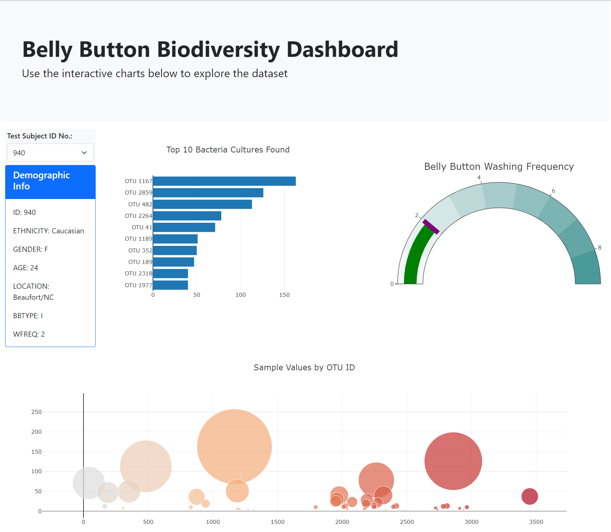

# plotly-challenge

This repository uses *javascript* and *plotly* to create a dashboard from a dataset containing information about bacteria cultures from belly button swabs. It can be accessed via [this url](https://jeremybar32093.github.io/plotly-challenge/index.html). The dashboard features a selector to choose a particular test subject ID, then elmements that update dynamically based on the selected subject ID. These dynamic elements were built using *plotly*, and are as follows:

* [Bar Chart](https://plotly.com/javascript/bar-charts/) featuring top 10 OTU IDs (bacteria types) based on selected test subject
* [Gauge Chart](https://plotly.com/javascript/gauge-charts/) displaying number of belly button scrubs per week based on selected test subject
* [Bubble Chart](https://plotly.com/javascript/bubble-charts/) displaying all OTU IDs based on select test subject
* [Bootstrap Card Component](https://getbootstrap.com/docs/4.0/components/card/) displaying demographic information of selected test subject

Plotly compontents and dynamic html logic was created in the **app.js** file located in the **/static/js/** folder. The dataset was read in from **/data/samples.json**. 

The final dashboard will end up looking like the following:

